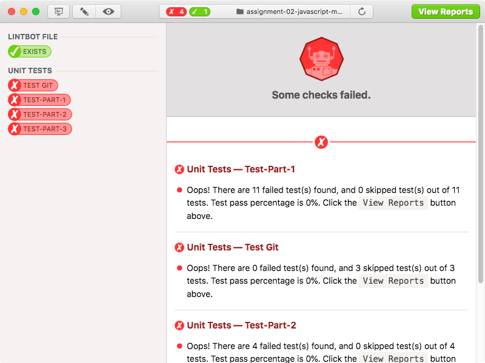
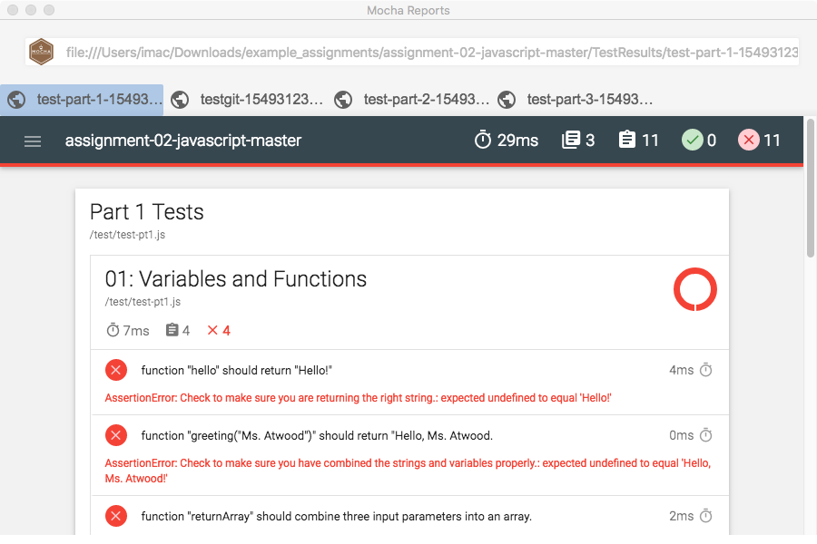

#  LINTBOT 
*Your marvellously magnificent ~~marking~~ linting robot.* 


## ABOUT

Markbot is a fork of [Markbot](https://github.com/thomasjbradley/markbot) with the capability to perform mocha testing. Git submission, Differ and Cheat detection has been disabled as this app is only for testing the student's work.
See full documentation on [Markbot Readme](https://github.com/thomasjbradley/markbot/blob/master/README.md)




## Repo configuration with Lintbot files

Lintbot file can be configured from a `.lintbot.yml` file. All other test from the original Markbot application can be used. See [Markbot - Repo configuration with Markbot files](https://github.com/thomasjbradley/markbot#repo-configuration-with-markbot-files) for full list. 

**Place the `lintbot.yml` file in the folder you want to test. Normally this is done when setting up a repository on GitHub that students would fork.**

Here is a basic Lintbot file with only mocha unit testing enabled:

- path: Path to the assignment's main index.html file
- labels: Human readable labels for the tests.
- urls: Location within the repo. (Possibility to make this a URL built-in, but pending testing.)

```yml
unittests:
  path: 'index.html'
  labels: ['Test Git','Test Node']
  urls: ['test/test-git.js','test/test-node.js']
```